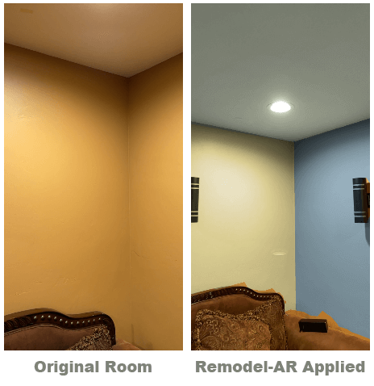

# Remodel-AR

**Remodel-AR** is a module that enables you to quickly and easily convert any ARSCNView into a virtual home remodeling visualization tool. This package currently contains all of the following features.

- AR assisted virtual room painting
  - Lidar approach (includes object occlusion, multiple wall painting)
  - Legacy approach (manually placed wall patches using by defining two points)
  - Floorplan approach (creating geometry by drawing floor corners)
  - ShaderPainting approach (painting walls using color comparsion for occlusions)
- Wall area and room area measurements

## Usage
To use **Remodel-AR**, you will need to add the XCFramework to your project and import **Remodel-AR**, then add an ARSCNView to your UIViewController and initialize an ARController instance.

For in-depth documentation for both SwiftUI and UIKit, see the [wiki](https://github.com/Passiolife/iOS-AR-Remodel-Module/wiki) page.
